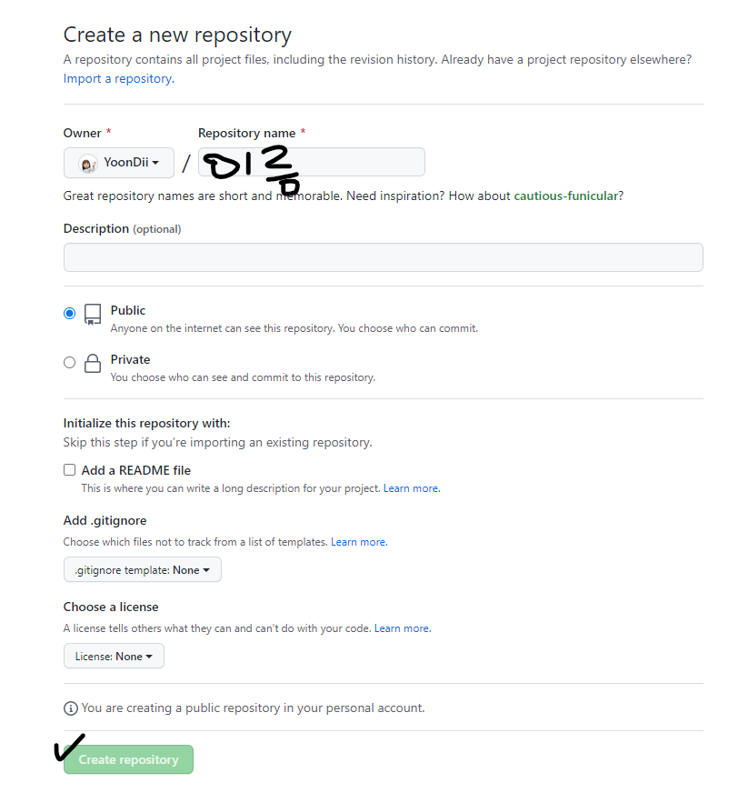

### 0706

# GitHub

### 1. GitHub

**원격저장소를 만들고, 저장소 설정을 하고 로컬저장소의 버전을 push한다.**

### 1-1. 원격저장소 설정 기본 명령어

|              명령어               |                내용                 |
| :-------------------------------: | :---------------------------------: |
|          git clone <url>          |          원격 저장소 복제           |
|           gir remote -V           |        원격저장소 정보 확인         |
| git remote add <원격저장소> <url> | 원격저장소 추가 (일반적으로 origin) |
|    git remote rm <원격저장소>     |           원격저장소 삭제           |
|  git push <원격저장소> <브랜치>   |          원격저장소에 push          |
|  git pull <원격저장소> <브랜치>   |        원격저장소로부터 pull        |

### 2. REPOSITORIES 생성하기.

* **초록색 NEW버튼 클릭**

  
  
  

* **레포 이름 정하고 / 공개여부 정하고/ 맨 밑 초록색버튼 클릭**

  
