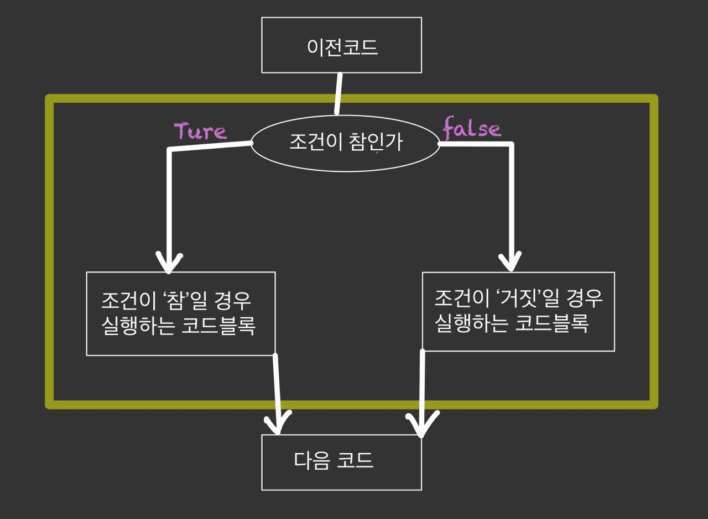
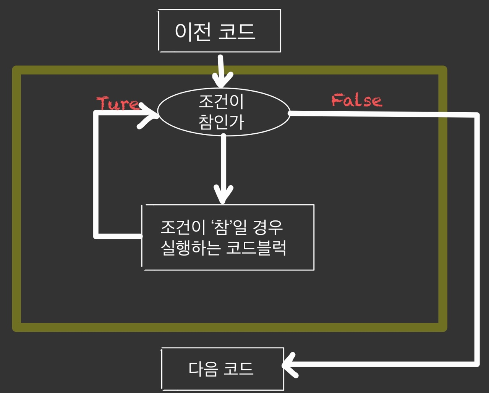

### 0712

# PYTHON (기초2)

### 1.제어문(Control Statement)

- 파이썬은 기본적으로 위에서부터 아래로 순차적으로 명령을 수행 
- 특정 상황에 따라 코드를 선택적으로 실행(분기/조건)하거나 계속하여 실행(반복)하는 제어가 필요함 
- 제어문은 순서도(flow chart)로 표현이 가능


### 2. 조건문(Conditional Statement)

- 조건문은 참/거짓을 판단할 수 있는 조건식과 함께 사용



#### 2-1. 기본형식

- **기본 if 문** 

```python
if # 참/거짓에 대한 조건식 :
	print() 
else :
    print()
    
ex) # 홀수/짝수 여부 출력하기.
num = int(input())
if num % 2 == 1 :
    print('홀수')
else:
    print('짝')
```

- **복수 조건문**

```python
if #조건식:
# Code block
elif #조건식:
# Code block
elif #조건식:
# Code block
else:
# Code block
```

- **중첩 조건문**

```python
if #조건식:
# Code block
if #조건식:
# Code block
else:
# Code block
```


### 3.반복문 (Loop Statement)

- 특정 조건을 도달할 때까지, 계속 반복되는 일련의 문장



- **반복문 종류**
  - • while 문 
    - 종료조건에 해당하는 코드를 통해 반복문을 종료시켜야 함 
  -  for 문 
    - 반복가능한 객체를 모두 순회하면 종료 (별도의 종료조건이 필요 없음) 
  - 반복 제어 
    -  break, continue, for-else

#### 3-1. While문

- while문은 조건식이 참인 경우 반복적으로 코드를 실행 
  - 조건이 참인 경우 들여쓰기 되어 있는 코드 블록이 실행됨 
  - 코드 블록이 모두 실행되고, 다시 조건식을 검사하며 반복적으로 실행됨 
  - while문은 무한 루프를 하지 않도록 종료조건이 반드시 필요

```python
while #조건식:
# Code block

#예제 1부터사용자가 입력한 양의 정수까지의 합 구하는 코드.
n = 0 # 값 초기화
total = 0
user = int(input())
while n <= user:
total += n
n += 1
print(total)
```

#### 3-2. for문

- for문은 시퀀스(string, tuple, list, range)를 포함한 순회가능한 객체(iterable) 요소를 모두 순회함 
  - 처음부터 끝까지 모두 순회하므로 별도의 종료조건이 필요하지 않음

```python
for <변수명> in <객체>:
	# Code block
	
#예제	
for fruit in ['apple', 'mango', 'banana']:
print(fruit)
print('끝')
```

- **For문 일반 형식**
- Iterable (객체)
  - 순회할 수 있는 자료형(str,list, dict 등) 
  - 순회형 함수(range, enumerate)

```python
#예제 사용자가 입력한 문자를 range를 활용하여 한 글자씩 출력하시오.
chars = input()
for idx in range(len(chars)):
	print(chars[idx])
   
```

- enumerate 순회
  - 인덱스와 객체를 쌍으로 담은 열거형(enumerate) 객체 반환 
    -  (index, value) 형태의 tuple로 구성된 열거 객체를 반환

```python
# 예시
members = ['민수', '영희', '철수']
for i in range(len(members)):
print(f’{i} {members[i]}')
for i, member in enumerate(members):
print(i, member)
      
enumerate(members)
list(enumerate(members))
# [(0, '민수'), (1, '영희'), (2, '철수')]
list(enumerate(members, start=1))
# [(1, '민수'), (2, '영희'), (3, '철수')]

```

- 딕셔너리 순회
  - 딕셔너리는 기본적으로 key를 순회하며, key를 통해 값을 활용

```python
#예시
grades = {'john': 80, 'eric': 90}
for name in grades:
	print(name)
```

#### 3-3. 반복문 제어

- **break** 
  - 반복문을 종료 

```python
#whlie문
n = 0
while True:
if n == 3:
break
print(n)
n += 1

#for문
for i in range(10):
if i > 1:
print('0과 1만 필요해!')
break
print(i)
```

- **continue** 
  - continue 이후의 코드 블록은 수행하지 않고, 다음 반복을 수행 

```python
for i in range(6):
	if i % 2 == 0:
		continue #continue를 만나면, 이후 코드인 print(i)가 
       			 #실행되지 않고 바로 다음 반복을 시행
	print(i)
```

- **for-else **
  - 끝까지 반복문을 실행한 이후에 else문 실행 
    - break를 통해 중간에 종료되는 경우 else 문은 실행되지 않음
    - else 문은 break로 중단되었는지 여부에 따라 실행

```python
for char in 'banana':
	if char == 'b':
		print('b!')
		break
else:
	print('b가 없습니다.')
```

*오늘 배운게,,제일 어려운 느낌이였다,,*

