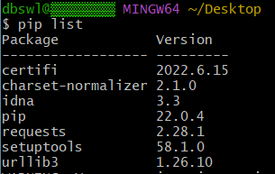

### 0721

# 파이썬 추가문법

#### 1. List Comprehension

- 표현식과 제어문을 통해 특정한 값을 가진 리스트를 간결하게 생성하는 방법
- [<\expression> for <변수> in <\interable>]
- [<\expression> for <변수> in <\interable> if <조건식>]

```python
# 1~3의 세제곱의 결과가 담긴 리스트를 만드세요.
cubic_list = []
for number in range(1, 4):
 cubic_list.append(number**3)
print(cubic_list)
##이렇게 변경가능
[number**3 for number in range(1, 4)]
```

#### 2. Dictionary Comprehension

- 표현식과 제어문을 통해 특정한 값을 가진 리스트를 간결하게 생성하는 방법

- {key: value for <변수> in <\iterable> }

- {key: value for <변수> in <\iterable>  if  <조건식>}

  ```python
  #1~3의 세제곱의 결과가 담긴 딕셔너리를 만드세요.
  cubic_dict = {}
  for number in range(1, 4):
  	cubic_dict[number] = number ** 3
  print(cubic_dict)
  ##이렇게 변경가능
  {number: number**3 for number in range(1, 4)}
  ```

#### 3. lambda [parameter] : 표현식

- 표현식을 꼐산한 결과값을 반환하는 함수로, 이름이 없는 함수여서 익명함수라고도 불림
- teturn문을 가질 수 없음
- 간편 조건문 외 조건문이나 반복문을 가질 수 없음
- 함수를 정의해서 사용하는 것보다 간결하게 사용가능
- defㄹㄹ 사용할 수 없는 곳에서도 사용가능

#### 4. Filter

- filter(function, iterable)
- 순회 가능한 데이터구조(iterable)의 모든 요소에 함수(function)적용하고, 그 결과가 True인 것들을 filter object로 반환

```python
def add(n):
 	return n % 2
numbers = [1, 2, 3]
result = filter(add, numbers)
print(result, type(result))
#<filter object at 0x10e4dfc10><class 'fliter'>
list(result) #리스트 형변환을 통해 결과 직접 확인.
#[1, 3]
```

#### 5. 파이썬 업데이트

> 파이썬은 버전별로 사용가능한 함수가 다르다.
>
> 예를들어, 3.6에서는 사용가능한 변수가 3.8에서는 없어졌다거나,
>
> 3.8에 새로생긴기능은 3.6에서는 사용할 수 없다.

#### 6. 모듈심화

##### 6-1.파이썬 표준 라이브러리(Python Standard Library, PSL)

- 파이썬에 기본적으로 설치된 모듈과 내장 함수 
-  https://docs.python.org/ko/3/library/index.html

##### 6-2. 파이썬 패키지 관리자(pip)

>https://pip.pypa.io/en/stable/user_guide/ 

- PyPI(Python Package Index)에 저장된 외부 패키지들을 설치하도록 도와주는 패키지 관리 시스템
-  최신 버전 / 특정 버전 / 최소 버전을 명시하여 설치 할 수 있음 
-  이미 설치되어 있는 경우 이미 설치되어 있음을 알리고 아무것도 하지 않음
  - $ pip install SomePackage 
  - $ pip install SomePackage==1.0.5 
  - $ pip install 'SomePackage>=1.0.4
    - 모두 bash, cmd 환경에서 사용되는 명령어
  - $ pip uninstall SomePackage : *패키지삭제*
    - pip는 패키지를 업그레이드 하는 경우 과거 버전을 자동으로 지워줌
  - $ pip list   :*패키지목록*
  - $ pip show SomePackage  :*패키지정보*
  - $ pip freeze > requirements.txt   :*관리하기*
    - 설치된 패키지의 비슷한 목록을 만들지만, pip install에서 활용되는 형식으로 출력 
    -  해당하는 목록을 requirements.txt(관습)으로 만들어 관리함
  - $ pip install –r requirements.txt  :*관리하기*

##### 6-3. 가상환경

- 파이썬 표준 라이브러리가 아닌 외부 패키지와 모듈을 사용하는 경우 모두 pip를 통해 설치를 해야함 
- 복수의 프로젝트를 하는 경우 버전이 상이할 수 있음 
  - 과거 외주 프로젝트 – django 버전 2.x
  -  신규 회사 프로젝트 – django 버전 3.x 
- 이러한 경우 가상환경을 만들어 프로젝트별로 독립적인 패키지를 관리 할 수 있음
- 파이썬은 특정 경로에 있는 프로그램을 실행시키는 것.



- **venv**
  - 가상 환경을 만들고 관리하는데 사용되는 모듈 (Python 버전 3.5부터)  
  - 특정 디렉토리에 가상 환경을 만들고, 고유한 파이썬 패키지 집합을 가질 수 있음  
  - 특정 폴더에 가상 환경이(패키지 집합 폴더 등) 있고,  실행 환경(예 – bash)에서 가상환경을 활성화 시켜 해당 폴더에 있는 패키지를 관리/사용함
  - 가상환경을 생성하면, 해당 디렉토리에 별도의 파이썬 패키지가 설치됨
    - $ python –m venv <폴더명>
  - 가상환경 비활성화는 $ deactivate 명령어를 사용
  - 동일 컴퓨터에서도 별도의 가상환경이 생김

*프로젝트때 많이 활용하는 패키지* 