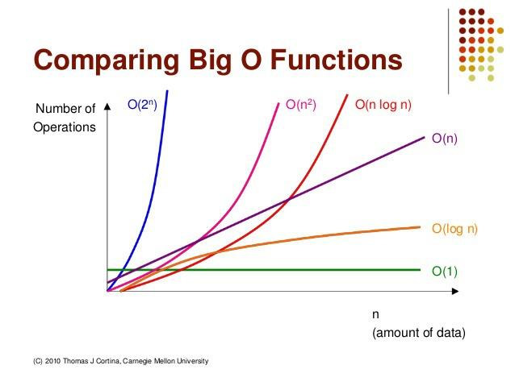

### 0726

# 시간복잡도 & 빅오(Big-O) 표시법

- 좋은 알고리즘이란?

​		Input을 넣은 후 Output이 나오는 시간이 짧은 알고리즘 !

- 시간 복잡도 (Time Complexity)
  계산 복잡도 이론에서 시간 복잡도는 문제를 해결하는데 걸리는 시간과 입력의 함수 관계를 가리킨다.

다양한 시간 복잡도 종류 

 

**빅오(Big-O) 표기법** 

|   O(1)   | 단순 산술 계산(덧셈, 뺄셈, 곱셉, 나눗셈) |
| :------: | :--------------------------------------- |
| O(logN)  | 크기 N인 리스트를 반절씩 순회/탐색       |
|   O(N)   | 크기 N인 리스트를 순회                   |
| O(NlogN) | 크기 N인 리스트를 반절씩 탐색 * 순회     |
|  O(N^2)  | 크기 M, N인 2중 리스트를 순회            |
|  O(N^3)  | 3중 리스트를 순회                        |
|  O(2^N)  | 크기 N 집합의 부분 집합                  |
|  O(N!)   | 크기 N 리스트의 순열                     |

같은 Output을 만드는 알고리즘이라도 시간 복잡도에 따라 성능이 달라질 수 있고,
시험에서 정답 여부가 갈리는 포인트가 된다는 것이다.

내장 함수, 메서드의 시간 복잡도도 확인할 필요가 있다.


# 리스트(List)

#### 1.배열 vs 연결리스트

#####  배열 (Array)

여러 데이터들이 연속된 메모리 공간에 저장되어 있는 자료구조
• 인덱스(Index)를 통해 데이터에 빠르게 접근
• 배열의 길이는 변경 불가능 → 길이를 변경하고 싶다면 새로 생성
• 데이터 타입은 고정

##### 연결 리스트 (Linked List)

데이터가 담긴 여러 노드들이 순차적으로 연결된 형태의 자료구조
• 맨 처음 노드부터 순차적으로 탐색
• 연결리스트의 길이 자유롭게 변경 가능 → 삽입, 삭제가 편리
• 다양한 데이터 타입 저장
• 데이터가 메모리에 연속적으로 저장되지 않음

#### 2.파이썬 리스트의 메서드

1) .append(원소) : 리스트 맨 끝에 새로운 원소 삽입
2) .pop(인덱스) : 특정 인덱스에 있는 원소를 삭제 및 반환
3) .count(원소) : 리스트에서 해당 원소의 개수를 반환 
4) .index(원소) : 리스트에서 처음으로 원소가 등장하는 인덱스 반환
5) .sort( ) : 리스트를 오름차순으로 정렬 , reverse=True 옵션을 통해 내림차순으로 정렬 가능
6) .reverse( ) : 리스트의 원소들의 순서를 거꾸로 뒤집기


#### 3. 자주 쓰이는 리스트 관련 내장함수

1) len(iterable) : 리스트의 길이(원소의 개수)를 반환
2) sum(iterable) : 리스트의 모든 원소의 합을 반환
3) max(iterable) : 리스트의 원소 중 최대값을 반환
4) min(iterable) : 리스트의 원소 중 최소값을 반환
5) sorted(iterable) : 오름차순으로 정렬된 새로운 리스트 반환, 원본 리스트는 변화 없음
6) reversed(iterable) : 리스트의 순서를 거꾸로 뒤집은 새로운 객체 반환, 원본 리스트는 변화 없음


#### 4. 리스트 컴프리헨션 (List Comprehension)

코드 한 줄만으로 새로운 리스트를 만드는 방법이다.

```python
numers = []
for i in range(5):
    number.append(i)
    
#리스트 컴프리헨션으로 바꾸면
number = [i for i in range(5)]
```


