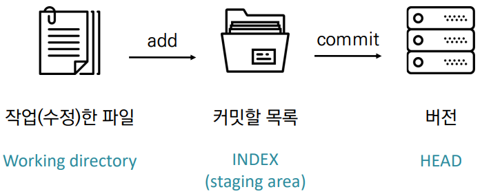

### 0705

# CLI/GIT

> GIT BASH를 활용하기 위한 기본 개념

### 1. CLI (Command Line Interface)

> CLI - 명령기반의 인터페이스 / GUI - 그래픽 기반의 인터페이스

* CLI, 커맨드 라인 인터페이스) 또는 명령어 인터페이스는 가상 터미널 또는 텍스트 터미널을 통해 사용자와 컴퓨터가 상호 작용하는 방식을 뜻한다.

* 작업 명령은 사용자가 툴바 키보드 등을 통해 문자열의 형태로 입력하며, 컴퓨터로부터의 출력 역시 문자열의 형태로 주어진다. 

* 이 같은 인터페이스를 제공하는 프로그램을 명령 줄 해석기 또는 셸이라고 부른다. 이를테면, 유닉스 셸(sh, ksh, csh, tcsh, bash 등)과 CP/M, 도스의 command.com("명령 프롬프트") 등이 있다.

* 프롬프트 기본 인터페이스
  * 컴퓨터 정보
  * 디렉토리
  * $

* 명령어 기본 구조

  * 특정 프로그램을 어떠한 인자와 함계 호출하도록 명령

  * ex) echo 프로그램을 'hello world'를 호출하도록 하기

    

- 디렉토리 관리
  - pwd(print working directory) : 현재 디렉토리 출력
  - cd 디렉토리이름 (change directory) : 디렉토리 이동
    - . : 현재 디렉토리/ .. :  상위 딜렉토리
  - ls (list) : 목록
  - mkdir (make directory) : 디렉토리 생성
  - touch : 파일생성
  - rm 파일명 :  파일 삭제하기
    - rm - r 폴더명: 폴더 삭제하기

### 2. GIT (분산 버전 관리 시스템)

* Git은 분산버전관리시스템으로 코드의 버전을 관리하는 도구 .
* 2005년 리눅스 커널을 위한 도구로 리누스 토르발스가 개발.
* 컴퓨터 파일의 변경사항을 추적하고 여러 명의 사용자들 간에 해당 파일들의 작업을 조율.

### 2-1. 기본흐름

1. 작업을 하고   2. 변경된 파일을 모아(add)   3. 버전으로 남긴다. (commit)

* Git은 파일을 modified, staged, committed로 관리 
  * modified : 파일이 수정된 상태 (add 명령어를 통하여 staging area로) 	
  * staged : 수정한 파일을 곧 커밋할 것이라고 표시한 상태 (commit 명령어로 저장소) 
  *  committed : 커밋이 된 상태

### 2-2 Git 기초 명령어

|           명령어           |              내용               |
| :------------------------: | :-----------------------------: |
|          git init          |        로컬 저장소 생성         |
|      git add  파일명       | 특정 파일/ 폴더의 변경사항 추가 |
| git commit -m '커밋메시지' |         커밋(버전 기록)         |
|         git status         |            상태확인             |
|          git log           |            버전확인             |

- **Status로 확인할 수 있는 파일의 상태**
  -  Tracked : 이전부터 버전으로 관리되고 있는 파일 
    -  Unmodified : git status에 나타나지 않음 
    -  Modified : Changes not staged for commit 
    -  Staged : Changes to be committed 
  -  Untracked : 버전으로 관리된 적 없는 파일 (파일을 새로 만든 경우)
  -  Noting to commit, working tree clean : 할게 없는 상황

* **다양한 옵션으로 로그 조회**
  * $ git log -1 : 제일 최근 커밋 나타내기
  *  $ git log --oneline : 최근 커밋 한줄로 나타내기
  * $ git log -2 --oneline :제일 최근 커밋 2개를 한줄로 나타내기

### 2-3. Git 설정 파일 (config)

* **사용자 정보 (commit author) : 커밋을 하기 위해 반드시 필요**

  *  git config —global user.name “username” 
    *  *Github에서 설정한 username으로 설정*

  * git config —global user.email “my@email.com” 
    * *Github에서 설정한 email로 설정*

* **설정 확인** 

  *  git config -l 
  *  git config —global -l 
  *  git config user.name

* **—system**

  *  /etc/gitconfig 

  * 시스템의 모든 사용자와 모든 저장소에 적용(관리자 권한) 

* **—global**
  * ~/.gitconfig 
  * 현재 사용자에게 적용되는 설정 
* **—local**
  * .git/config
  *  특정 저장소에만 적용되는 설정

